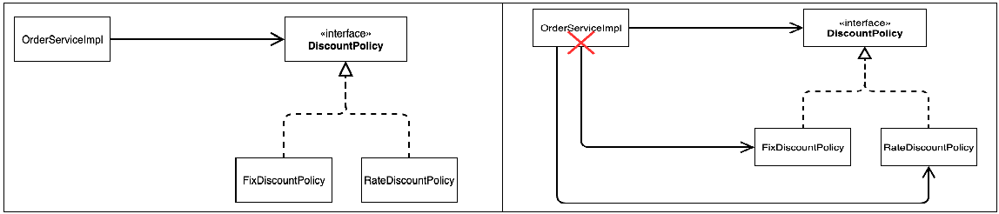
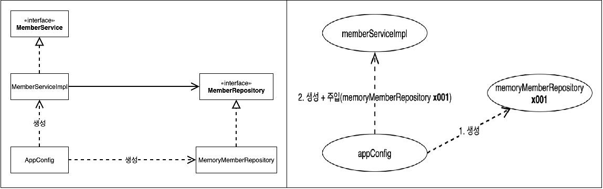
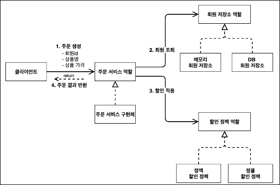
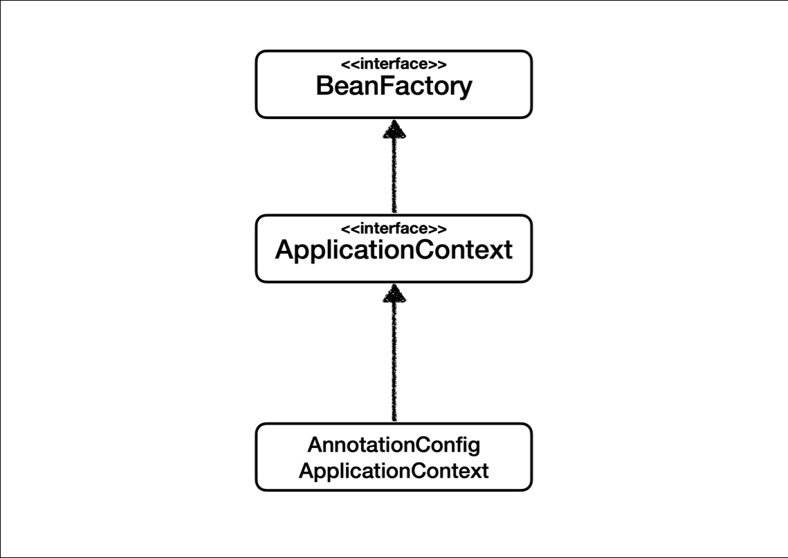
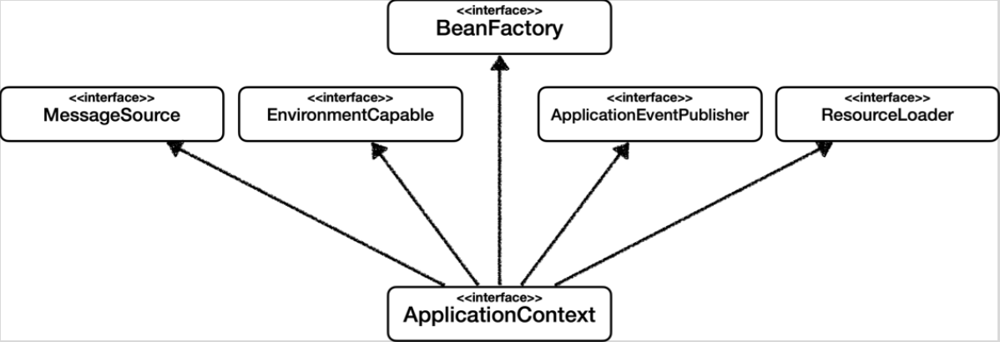
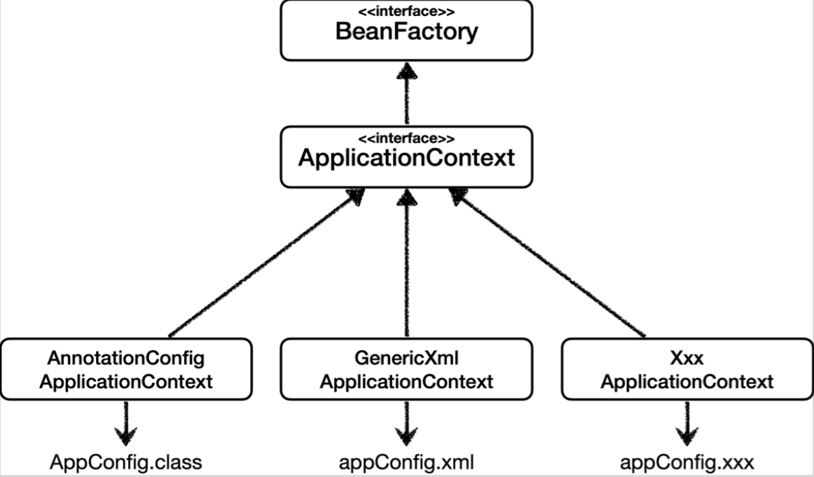

[TOC]

# 다형성

## 역할과 구현을 분리

* 역할과 구현으로 구분하면 단순해지고, 유연해지며 변경도 편리해진다.
* 클라이언트는 대상의 역할(인터페이스)만 알면됨
* 클라이언트는 구현 대상의 내부 구조를 몰라도 됨
* 클라이언트는 구현 대상의 내부 구조가 변경되도 영향을 받지 않음
* 클라이언트는 구현 대상 자체를 변경해도 영향을 받지 않음

## 자바에서 역할 구현 분리

* 자바의 다형성을 활용(interface), 물론 상속도 가능하지만 interface가 더 나음
    * 역할 : 인터페이스
    * 구현 : 인터페이스를 구현한 클래스, 구현 객체
* 객체를 설계할 때 역할과 구현을 명확히 분리
* 객체 설계시 역할을 먼저 부여하고, 그 역할을 수행하는 구현 객체 만듬

### 장단점

* 인터페이스를 구현한 객체 인스턴스를 실행 시점에 유연하게 변경 가능
* 클라이언트를 변경하지 않고, 서버의 구현 기능을 유연하게 변경
* 인터페이스 자체가 변한다면 클라이언트 서버 모두에 큰 변경이 발생


# SOLID 5원칙

> SRP 단일 책임 원칙
>
> OCP 개방 폐쇄 원칙
>
> LSP 리스코프 치환 원칙
>
> ISP 인터페이스 분리 원칙
>
> DIP 의존관계 역전 원칙

객체 지향의 핵심은 다형성

다형성 만으로는 쉽게 부품을 갈아 끼우듯 개발할 수 없으며 구현 객체를 변경할 때 클라이언트 코드가 함께 변형된다 -> OCP, DIP 위배

## SRP 단일 책임 원칙

한 클래스는 하나의 책임만 가져야 한다.

변경이 있을 때 파급 효과가 작으면 단일 책임 원칙을 잘 지킨것

## OCP 개방 폐쇄 원칙

소프트웨어 요소는 확장에서는 열려 있으나 변경에는 닫혀 있어야 한다.

다형성을 활용해서 원칙을 지키고자 노력해야함

인터페이스를 구현한 새로운 클래스를 하나 만들어 새로운 기능을 구현

구현 객체를 변경하려면 클라이언트 코드를 변경 -> 객체를 생성하고, 연관관계를 맺어주는 별도의 조립, 설정자가 필요!


## LSP 리스코프 치환 원칙

프로그램의 객체는 프로그램의 정확성을 깨뜨리지 않으면서 하위 타입의 인스턴스로 바꿀 수 잇어야 한다.

하위 클래스는 인터페이스 규약을 지켜야 한다는 것 -> 다형성을 지원하기 위한 원칙

단순히 컴파일이 아니라 규약을 지켜서 원래 설계한 기능을 수행할 수 있도록 해야함


## ISP 인터페이스 분리 원칙

특정 클라이언트를 위한 인터페이스 여러 개가 범용 인터페이스 보다 나음

인터페이스를 분리하면 어떤 클라이언트가 변해도 다른 클라이언트에 영향을 주지 않는다.

인터페이스가 명확해 지고 대체 가능성이 높아진다.


## DIP 의존관계 역전 원칙

추상화에 의존하며 구체화에 의존하지 않는다.

역할(추상화)에 의존하여 구현체의 변경을 용이하게 수행하게 해야한다.


## 스프링 -> 객체 지향 설계

인터페이스를 도입하면 추상화란 비용이 발생 -> 확장 가능성이 없다면 구체화된 클래스를 직접 사용하고 향후 필요할때 리팩토링해서 인터페이스를 도입.

# Member, Order Serivce 개발
작성하는 코드에 대해서 


# 지금 까지 코드의 문제점

## DIP문제



코드상으로 `OrderServiceImpl`이 `DiscountPolicy`를 의존하는 것이 아니라 `FixDiscountPolicy`, `RateDiscountPolicy`에 의존하여 구체(구현) 클래스를 의존하고 있다. -> DIP문제

또한, 다음과 같이 코드가 구성될 경우 null point exception이 발생한다.

```java
public class OrderServiceImpl implements OrderService {

    private final MemberRepository memberRepository = new MemoryMemberRepository();
    private DiscountPolicy discountPolicy;

    @Override
    public Order createOrder(Long memberId, String itemName, int itemPrice) {
        Member member = memberRepository.findById(memberId);
        int discountPrice = discountPolicy.discount(member, itemPrice);
        return new Order(memberId, itemName, itemPrice, discountPrice);
    }
}
```

이 문제를 해결하려면 누군가가 클라이언트인 `OrderServiceImpl` 에 `DiscountPolicy` 의 구현 객체를 대신 생성하고 주입해주어야 한다.


## AppConfig 를 활용한 해결

애플리케이션의 전체 동작 방식을 구성(config)하기 위해, 구현 객체를 생성하고, 연결하는 책임을 가지는 별도의 설정 클래스를 이용하여 관심사를 분리하고 주입하게 한다.

생성자 주입 방법을 이용해 해결

* `MemberRepository` 인터페이스만 의존한다.
* `MemberServiceImpl` 입장에서 생성자를 통해 어떤 구현 객체가 들어올지(주입될지)는 알 수 없다.
* `MemberServiceImpl` 의 생성자를 통해서 어떤 구현 객체를 주입할지는 오직 외부(`AppConfig`)에서 결정된다.
* `MemberServiceImpl` 은 이제부터 의존관계에 대한 고민은 외부에 맡기고 실행에만 집중하면 된다.

```java
public class MemberServiceImpl implements MemberService {
    private final MemberRepository memberRepository;
    
    public MemberServiceImpl(MemberRepository memberRepository) {
   		this.memberRepository = memberRepository;
    }
    
    public void join(Member member) {
    	memberRepository.save(member);
    }
    
    public Member findMember(Long memberId) {
    	return memberRepository.findById(memberId);
    }
}
```



* 객체의 생성과 연결은 `AppConfig` 가 담당한다.
* DIP 완성: `MemberServiceImpl` 은 `MemberRepository` 인 추상에만 의존하면 된다. 이제 구체 클래스를 몰라도 된다.
* 관심사의 분리: 객체를 생성하고 연결하는 역할과 실행하는 역할이 명확히 분리되었다.
* `appConfig` 객체는 `memoryMemberRepository` 객체를 생성하고 그 참조값
* `MemberServiceImpl`을 생성하면서 생성자로 전달한다.
* 클라이언트인 memberServiceImpl 입장에서 보면 의존관계를 마치 외부에서 주입해주는 것 같다고 해서 `DI`(Dependency Injection) 우리말로 의존관계 주입 또는 의존성 주입이라 한다.


* `AppConfig`는 애플리케이션의 실제 동작에 필요한 구현 객체를 생성한다.
  * `MemberServiceImpl`
  * `MemoryMemberRepository`
  * `OrderServiceImpl`
  * `FixDiscountPolicy`
* `AppConfig`는 생성한 객체 인스턴스의 참조(레퍼런스)를 생성자를 통해서 주입(연결)해준다.
  * `MemberServiceImpl` -> `MemoryMemberRepository`
  * `OrderServiceImpl` -> `MemoryMemberRepository` , `FixDiscountPolicy`


## 리펙토링

중복 코드를 제거하고 역할에 따른 구현을 하기 위해 진행

아래 그림의 모든 모습을 한눈에 보여줘야 하며 각 기능에 대해 중복이 없어야함.




# 스프링 전환 전 정리

## SOLID 적용

### SRP 단일 책임 원칙
한 클래스는 하나의 책임만 가져야 한다.
클라이언트 객체는 직접 구현 객체를 생성하고, 연결하고, 실행하는 다양한 책임을 가지고 있음
`SRP` 단일 책임 원칙을 따르면서 관심사를 분리함
구현 객체를 생성하고 연결하는 책임은 `AppConfig`가 담당
클라이언트 객체는 실행하는 책임만 담당

### DIP 의존관계 역전 원칙
프로그래머는 “추상화에 의존해야지, 구체화에 의존하면 안된다.” 의존성 주입은 이 원칙을 따르는 방법 중
하나다.
새로운 할인 정책을 개발하고, 적용하려고 하니 클라이언트 코드도 함께 변경해야 했다. 왜냐하면 기존 클라이언트 코드(`OrderServiceImpl`)는 `DIP`를 지키며 `DiscountPolicy` 추상화 인터페이스에 의존하는 것 같았지만, `FixDiscountPolicy` 구체화 구현 클래스에도 함께 의존했다.
클라이언트 코드가 `DiscountPolicy` 추상화 인터페이스에만 의존하도록 코드를 변경했다.
하지만 클라이언트 코드는 인터페이스만으로는 아무것도 실행할 수 없다.
`AppConfig`가 `FixDiscountPolicy` 객체 인스턴스를 클라이언트 코드 대신 생성해서 클라이언트 코드에 의존관계를 주입했다. 이렇게해서 `DIP` 원칙을 따르면서 문제도 해결했다.

### OCP
소프트웨어 요소는 확장에는 열려 있으나 변경에는 닫혀 있어야 한다
다형성 사용하고 클라이언트가 DIP를 지킴
애플리케이션을 사용 영역과 구성 영역으로 나눔
AppConfig가 의존관계를 FixDiscountPolicy RateDiscountPolicy 로 변경해서 클라이언트 코
드에 주입하므로 클라이언트 코드는 변경하지 않아도 됨
소프트웨어 요소를 새롭게 확장해도 사용 영역의 변경은 닫혀 있다!

## IoC, DI,  컨테이너
### 제어의 역전 IoC(Inversion of Control)

기존 프로그램은 클라이언트 구현 객체가 스스로 필요한 서버 구현 객체를 생성하고, 연결하고, 실행했다. 한마디로 구현 객체가 프로그램의 제어 흐름을 스스로 조종했다. 개발자 입장에서는 자연스러운 흐름이다.
반면에 `AppConfig`가 등장한 이후에 구현 객체는 자신의 로직을 실행하는 역할만 담당한다. 프로그램의 제어 흐름은 이제 `AppConfig`가 가져간다. 예를 들어서 `OrderServiceImpl` 은 필요한 인터페이스들을 호출하지만 어떤 구현 객체들이 실행될지 모른다.
프로그램에 대한 제어 흐름에 대한 권한은 모두 `AppConfig`가 가지고 있다. 심지어 `OrderServiceImpl`도 `AppConfig`가 생성한다. 그리고 `AppConfig`는 `OrderServiceImpl` 이 아닌 `OrderService` 인터페이스의 다른 구현 객체를 생성하고 실행할 수 도 있다. 그런 사실도 모른체 `OrderServiceImpl`은 묵묵히 자신의 로직을 실행할 뿐이다.
이렇듯 프로그램의 제어 흐름을 직접 제어하는 것이 아니라 외부에서 관리하는 것을 `제어의 역전(IoC)`이라 한다.

### 프레임워크 vs 라이브러리
프레임워크가 내가 작성한 코드를 제어하고, 대신 실행하면 그것은 프레임워크가 맞다. (JUnit)
반면에 내가 작성한 코드가 직접 제어의 흐름을 담당한다면 그것은 프레임워크가 아니라 라이브러리다.

### 의존관계 주입 DI(Dependency Injection)
OrderServiceImpl 은 DiscountPolicy 인터페이스에 의존한다. 실제 어떤 구현 객체가 사용될지는 모른다.
의존관계는 정적인 클래스 의존 관계와, 실행 시점에 결정되는 동적인 객체(인스턴스) 의존 관계 둘을 분리해서 생각해야 한다.
#### 정적인 클래스 의존관계
클래스가 사용하는 import 코드만 보고 의존관계를 쉽게 판단할 수 있다. 정적인 의존관계는 애플리케이션
을 실행하지 않아도 분석할 수 있다.
`OrderServiceImpl`은 `MemberRepository` , `DiscountPolicy`에 의존한다는 것을 알 수 있다.
그런데 이러한 클래스 의존관계 만으로는 실제 어떤 객체가 `OrderServiceImpl` 에 주입 될지 알 수 없다.

#### 동적인 객체 인스턴스 의존 관계

애플리케이션 실행 시점에 실제 생성된 객체 인스턴스의 참조가 연결된 의존 관계다.
객체 다이어그램
애플리케이션 실행 시점(런타임)에 외부에서 실제 구현 객체를 생성하고 클라이언트에 전달해서 클라이언
트와 서버의 실제 의존관계가 연결 되는 것을 의존관계 주입이라 한다.
객체 인스턴스를 생성하고, 그 참조값을 전달해서 연결된다.
의존관계 주입을 사용하면 클라이언트 코드를 변경하지 않고, 클라이언트가 호출하는 대상의 타입 인스턴스
를 변경할 수 있다.
의존관계 주입을 사용하면 정적인 클래스 의존관계를 변경하지 않고, 동적인 객체 인스턴스 의존관계를 쉽
게 변경할 수 있다.
### IoC 컨테이너, DI 컨테이너
`AppConfig`처럼 객체를 생성하고 관리하면서 의존관계를 연결해 주는 것을 `IoC 컨테이너` 또는 `DI 컨테이너`라 한다.
의존관계 주입에 초점을 맞추어 최근에는 주로 **`DI 컨테이너`**라 한다.
또는 어샘블러, 오브젝트 팩토리 등으로 불리기도 한다.

# 스프링 부트 전환

```java
@Configuration
public class AppConfig {

    @Bean
    public MemberRepository memberRepository(){
        return new MemoryMemberRepository();
    }

    @Bean
    public DiscountPolicy discountPolicy(){
        return new FixDiscountPolicy();
    }

    @Bean
    public MemberService memberService(){
        return new MemberServiceImpl(memberRepository());
    }

    @Bean
    public OrderService orderService(){
        return new OrderServiceImpl(memberRepository(), discountPolicy());
    }
}
```

```java
public class DeliveryApplication {

	public static void main(String[] args) {
        ApplicationContext applicationContext = new AnnotationConfigApplicationContext(AppConfig.class);
        MemberService memberService = applicationContext.getBean("memberService", MemberService.class);
        OrderService orderService = applicationContext.getBean("orderService", OrderService.class);
        OrderService orderService2 = applicationContext.getBean("orderService", OrderService.class);

        System.out.println(memberService);
        System.out.println(orderService);
        System.out.println(orderService2); // 싱글턴 확인해 보고 싶어 넣어봄
    
    }
}
```

`ApplicationContext`를 스프링 컨테이너라 한다.
기존에는 개발자가 `AppConfig`를 사용해서 직접 객체를 생성하고 `DI`를 했지만, 이제부터는 스프링 컨테이
너를 통해서 사용한다.
스프링 컨테이너는 `@Configuration`이 붙은 `AppConfig`를 설정(구성) 정보로 사용한다. 여기서 `@Bean`이라 적힌 메서드를 모두 호출해서 반환된 객체를 스프링 컨테이너에 등록한다. 이렇게 스프링 컨테이너에 등록된 객체를 `스프링 빈`이라 한다.
스프링 빈은 `@Bean` 이 붙은 메서드의 명을 스프링 빈의 이름으로 사용한다. (`memberService`, `orderService`)
이전에는 개발자가 필요한 객체를 `AppConfig` 를 사용해서 직접 조회했지만, 이제부터는 스프링 컨테이너를 통해서 필요한 스프링 빈(객체)를 찾아야 한다. 스프링 빈은 `applicationContext.getBean()`메서드를 사용해서 찾을 수 있다.
기존에는 개발자가 직접 자바코드로 모든 것을 했다면 이제부터는 `스프링 컨테이너`에 객체를 `스프링 빈`으로 등록하고, 스프링 컨테이너에서 스프링 빈을 찾아서 사용하도록 변경되었다.


# 빈 조회 방법

스프링 컨테이너에서 스프링 빈을 찾는 가장 기본적인 조회 방법

* `getBean(빈이름, 타입)`
* `getBean(타입)`

조회 대상 스프링 빈이 없으면 예외 발생

* `NoSuchBeanDefinitionException`

타입으로 조회시 같은 타입의 스프링 빈이 둘 이상이면 오류가 발생한다. 이때는 빈 이름을 지정하자.
`ac.getBeansOfType()` 을 사용하면 해당 타입의 모든 빈을 조회할 수 있다.

부모 타입으로 조회하면, 자식 타입도 함께 조회한다.

## BeanFactory와 ApplicationContext

### BeanFactory



스프링 컨테이너의 최상위 인터페이스로 스프링 빈을 관리하고 조회하는 역할을 담당한다.
getBean() 을 제공한다.
지금까지 우리가 사용했던 대부분의 기능은 BeanFactory가 제공하는 기능이다.

### ApplicationContext



BeanFactory 기능을 모두 상속받아서 ApplicationContext는 빈 관리기능 + 편리한 부가 기능을 제공한다.

BeanFactory나 ApplicationContext를 스프링 컨테이너라 한다.

ApplicatonContext가 제공하는 부가기능

* 메시지소스를 활용한 국제화 기능(예를 들어서 한국에서 들어면 한국어로, 영어권에서 들어오면 영어로 출력)
* 환경변수
  * 로컬, 개발, 운영등을 구분해서 처리
* 애플리케이션 이벤트
  * 이벤트를 발행하고 구독하는 모델을 편리하게 지원
* 편리한 리소스 조회
  * 파일, 클래스패스, 외부 등에서 리소스를 편리하게 조회

정리
ApplicationContext는 BeanFactory의 기능을 상속받는다.
ApplicationContext는 빈 관리기능 + 편리한 부가 기능을 제공한다.
BeanFactory를 직접 사용할 일은 거의 없다. 부가기능이 포함된 ApplicationContext를 사용한다.
BeanFactory나 ApplicationContext를 스프링 컨테이너라 한다.

## 다양한 설정 형식 지원 - 자바 코드, XML

스프링 컨테이너는 다양한 형식의 설정 정보를 받아드릴 수 있게 유연하게 설계되어 있다.


* `AnnotationConfigApplicationContext` 는 `AnnotatedBeanDefinitionReader` 를 사용해서`AppConfig.class`를 읽고 `BeanDefinition` 을 생성한다.
* `GenericXmlApplicationContext` 는 `XmlBeanDefinitionReader` 를 사용해서 `appConfig.xml` 설정 정보를 읽고 `BeanDefinition` 을 생성한다.

* 새로운 형식의 설정 정보가 추가되면, `XxxBeanDefinitionReader`를 만들어서 `BeanDefinition` 을 생성하면 된다.

## BeanDefinition 살펴보기

* `BeanClassName`: 생성할 빈의 클래스 명(자바 설정 처럼 팩토리 역할의 빈을 사용하면 없음)

* `factoryBeanName`: 팩토리 역할의 빈을 사용할 경우 이름, 예) appConfig

* `factoryMethodName`: 빈을 생성할 팩토리 메서드 지정, 예) memberService
* `Scope`: 싱글톤(기본값)
* `lazyInit` : 스프링 컨테이너를 생성할 때 빈을 생성하는 것이 아니라, 실제 빈을 사용할 때 까지 최대한 생성을 지연처리 하는지 여부
* `InitMethodName`: 빈을 생성하고, 의존관계를 적용한 뒤에 호출되는 초기화 메서드 명
* `DestroyMethodName` : 빈의 생명주기가 끝나서 제거하기 직전에 호출되는 메서드 명
* `Constructor arguments`, `Properties`: 의존관계 주입에서 사용한다. (자바 설정 처럼 팩토리 역할의 빈을 사용하면 없음)